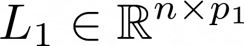
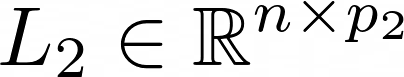
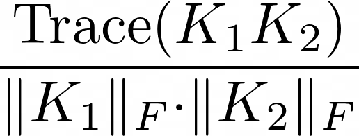
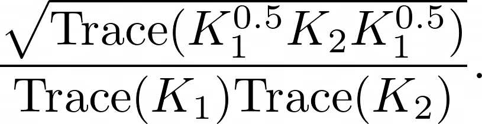

# Investigating Similarity Metrics for Convolutional Neural Networks in the Case of Unstructured Pruning

This repository hosts the source code for the paper titled "Investigating Similarity Metrics for Convolutional Neural Networks in the Case of Unstructured Pruning" (*preprint not available yet*) by Alessio Ansuini, Eric Medvet, Felice Andrea Pellegrino, and Marco Zullich.
Currently, the paper is undergoing a review process by Springer for the selection in an LNCS Series Book.

The paper is itself an extension of a previous publication of ours, ["On the Simlarity between Hidden Layers of Pruned and Unpruned Convolutional Neural Networks"](https://www.insticc.org/Primoris/Resources/PaperPdf.ashx?idPaper=89603).

In this repository, we are going to provide a minimal library (written in Python) for the sake of reproducibility of the experiments contained in both the papers above.

* The library is currently undergoing a testing phase and is visible under [the testing branch](https://github.com/marcozullich/pruned_layer_similarity/tree/testing).

An IPython Notebook will soon be added containing a demo showcasing the application of the library on a small-scale dataset like MNIST.

## Installation tips

You need Python 3.6+ to run this library

1. Clone with `git clone https://github.com/marcozullich/pruned_layer_similarity.git`
2. Install missing packages with `pip install -r requirements.txt`

## Theoretical background

### Neural Network (NN) pruning

Essentially, pruning a NN is the act of removing one of more of the connections (also called *synapses*) between neurons.
Pruning can be

* unstructured
* structured.

Unstructured pruning acts with no regard for the *position* of the neuron inside the NN; the connection is just cut, according to a given criterion, without considering in which layer it belongs, or where in the layer it is positioned.
Structured pruning, on the other hand, cuts synapses in an organized fashion: for instance, all of the connections leading to a neuron may be pruned (thus removing the neuron from the NN) or to whole groups of neurons (e.g., those forming a *convolutional channel*).

<figure class="image">
  
  <figcaption>{{ Examplification of NN pruning. Image taken from [1] }}</figcaption>
</figure>

<!--![**Fig. 1**: exemplification of NN pruning. Image taken from [1]](images/han_2015_pruning.png)-->

In the figure above, the two types of NN pruning are exemplified:
- unstructured pruning removes connections with a criterion not dependent from the position inside the NN / the layer;
- structured pruning removes all the connections leading to a given neuron.

In our work, we experiment with a specific technique of unstructured pruning, Iterative Magnitude Pruning (IMP).

#### IMP

IMP is an unstructured pruning technique that removes connections having a low magnitude, i.e., synapses with corresponding parameter exhibiting a low magnitude.

There are multiple variants of IMP, although the latest one (and the one yielding the most accurate pruned NNs) is called Learning Rate Rewind (LRR).
Starting from a fully trained NN (also called **_complete network_**) with a given optimizer and Learning Rate (LR) annealing schedule, it prunes following a simple iterative scheme:

1. prune a fixed portion of parameters having the smallest magnitude;
2. keep the surviving parameters along with the value they had just before the point 1.;
3. re-train the NN with the same optimizer LR annealing schedule used for the training of the complete network.

For the details concerning the application of IMP with LRR, refer to the paper that introduced this technique, [2].

## Similarity metrics for layers of NNs

Computing similarities for layers of NNs is a hard task, mainly because:

1. we may want to compare structurally different NNs with parameters living in seemingly *incompatible* spaces;
2. even if we wish to compare two architecturally identical NNs, the randomness of the optimization routines may lead to two NNs learning the exact same features, but the neurons within the same layers may be *permuted* such that the same neuron may learn two different features in the two NNs.

Thus, we wish for similarity metrics which are

1. able to capture similarities when the layers are architecturally different;
2. invariant to rotations (i.e., orthogonal transformation) of the spaces, in order to capture possible *permutations* in the neurons space

### Representations of layers

In order to compare layers, we need to get a view of the possible responses of each neuron to all the possible inputs of the NN.
Since it is impossible to get a full view of the infinite activations that a neuron may exhibit, we usually evaluate the network on a (possibly large and representative of the data manifold) set of n data points.
If a layer has p neurons, we usually store all the activation of these neurons to the n data points, obtaining a n × p matrix also called *activation matrix* which acts as the representation of this layer [3].

There exist similarity matrix which take one step further for the determination of the layer and consider the Gram matrix obtained from the application of a given kernel (e.g., linear) to the activation matrix.
In this case, the representation of the layer is an n × n symmetric positive semi-definite matrix.

In the following sections, we will consider two generic fully-connected layers 

and

### Similarity metrics based on Canonical Correlation Analysis (CCA)

CCA acts on the two layers by finding linear transforms such that the two layers get transforms into two sets of orthonormal vectors, Z1 and Z2, in the n-dimensional real space.
The columns of Z1 and Z2 are built s.t. their residual Pearson correlation gets maximized: hence, we find a set of (decreasing) Pearson correlations ρ1,...,ρp, where p = min(p1, p2).
We can average those values obtaining the **Mean CCA Similarity**.
A weighted average yields the **Projection Weighted CCA (PWCCA)**. Refer to [4] for more details.

### Similarity metrics based on kernels

#### Centered Kernel Alignment (CKA)

CKA is a normalized similarity metric measuring the (in)dependence between two sets of features and acts on the kernels (Gram matrices) of the two layers L1, L2.
It was proposed in [5] as a similarity metric for layers of NNs.

Given K1, K2 centered Gram matrices obtained by applying a kernel function to the rows of L1, L2, it is calculated as

where ||•||F represents the Frobenius norm.

#### Normalized Bures Similarity (NBS)

NBS is similar to CKA, but tries to quantify the *optimal transport* between two probability distributions.
It was proposed in [6] as a similarity metric for layers of NNs.

It is calculated as

## Content of this repo

- The `layer_sim` folder contains the Python library with minimal modules for:
  - training (and testing) the net (`train.py`); nets architectures are in `networks.py` and are comprehensive of a method to get the representations out of all the layers of interest in these nets
  - pruning a fully-trained net using IMP(`pruning/` folder)
  - comparing representations of trained nets (`nn_comparison.py`)
- A demo will be soon released for showcasing the application of this library to a small-scale problem; however, we provide all the tools to extend this analysis to larger datasets and networks.

## Abouts the Authors

[Alessio Ansuini](https://it.linkedin.com/in/alessioansuini) is a Research Technologist for AREA Science Park in Trieste (Italy). You may also check out [his GitHub page](https://ansuini.github.io).

[Eric Medvet](http://medvet.inginf.units.it/) and [Felice Andrea Pellegrino](http://control.units.it/pellegrino/en/) are Associate Professors at the Dept. of Engineering and Architecture, University of Trieste (Italy).

[Marco Zullich](https://it.linkedin.com/in/marco-zullich-00559660) is a PhD student at the Dept. of Engineering and Architecture, University of Trieste (Italy). You may contact him at {name}.{surname} (at) phd.units.it.

## References

[1] [Han, Song, et al. "Learning both weights and connections for efficient neural network." Advances in neural information processing systems. 2015.](http://papers.nips.cc/paper/5784-learning-both-weights-andconnections-)

[2] [Renda, Alex, et al. "Comparing Rewinding and Fine-tuning in Neural Network Pruning." International Conference on Learning Representations. 2020](https://openreview.net/forum?id=S1gSj0NKvB)

[3] [Raghu, Maithra, et al. "Svcca: Singular vector canonical correlation analysis for deep learning dynamics and interpretability." Advances in Neural Information Processing Systems. 2017.](http://papers.nips.cc/paper/7188-svcca-singular-vector-canonical-correlation-analysis-for-deep-understanding-and-improvement)

[4] [Morcos, Ari, Maithra Raghu, and Samy Bengio. "Insights on representational similarity in neural networks with canonical correlation." Advances in Neural Information Processing Systems. 2018.](http://papers.nips.cc/paper/7815-insights-on-representational-similarity-in-neural-networks-with-canonical-correlation)

[5] [Tang, Shuai, et al. "Similarity of Neural Networks with Gradients." arXiv preprint arXiv:2003.11498 (2020).](https://arxiv.org/abs/2003.11498)
